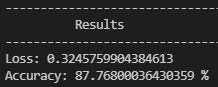

<!-- Reference:
https://github.com/othneildrew/Best-README-Template -->

<!-- PROJECT LOGO -->
 

  <h1 align="center"><i> Sentiment Analysis using CNN </i></h1>

  
  
  

    A Convolutional Neural Network to perform Natural Language Processing (NLP) on large review data sets !
  

 

<!-- TABLE OF CONTENTS -->

  
Table of Contents

  <ol>
    <li><a href="#about-the-project">About The Project</a></li>
    <li><a href="#built-with">Built With</a></li>
    <li><a href="#getting-started">Getting Started</a></li>
    <li><a href="#case-study-analysis">Case Study Analysis</a></li>
    <li><a href="#license-or-author">License or Author</a></li>
    <li><a href="#contact">Contact</a></li>
    <li><a href="#acknowledgments">Acknowledgments</a></li>
  </ol>

 

<!-- ABOUT THE PROJECT -->
## About The Project
  In this project, we make use of TensorFlow's keras library to create a Convolutional Neural Network, that can effectively classify real review data as positive or negative using the CNN alone, without having to utilize any word embedding or representation packages such as Word2Vec or Glove.

  For case study analaysis, we use IMDB's large movie review dataset that is publicly available. The results and discussions of the analysis can be found in one of the below sections.

  
(<a href="#readme-top">back to top</a>)

## Built With
  &nbsp; &nbsp; &nbsp; &nbsp;  &nbsp; &nbsp; &nbsp; &nbsp; &nbsp; &nbsp; &nbsp; &nbsp;  &nbsp; &nbsp;

  &nbsp; &nbsp; &nbsp; &nbsp; <b><i> Python</i></b> &nbsp; &nbsp; &nbsp; &nbsp; &nbsp; <b><i> TensorFlow </i></b>

  
(<a href="#readme-top">back to top</a>)

<!-- GETTING STARTED -->
## Getting Started
  #### Prerequisites
  * Python
  * TensorFlow
  * Numpy
  * Pandas
  * sklearn
  * pickle
  * glob

  #### Installation & Use
  1. Get <b>train_nlp.py</b> and <b>utils.py</b>
  2. Import <b>NLP </b> in your implementation
  3. Use the functions as per your convinience and configuration.

  
(<a href="#readme-top">back to top</a>)

<!-- USAGE EXAMPLES -->
## Case Study Analysis
  * #### Dataset creation & Pre-processing Steps:
    1. The data has been provided in the form of multiple text files, where the content of the file is the input, while the label is represented by the parent folder’s name (‘neg’ – meaning negative, ‘pos’ – meaning positive)
    2. For each of ‘test’ and ‘train’ folders, the following pre-processing steps were performed:
       * Positive and negative directory files were traversed & the corresponding inputs and labels were created:
       
          <b>Inputs:</b> String containing file content.
          
          <b>Labels:</b> One hot-encoded, with [1, 0] representing positive and [0,1] representing negative reviews.
          
          The labels do not require any further processing.

       * Next, we needed the input in a form that is better understandable to the machine. Hence, we tokenized the input; i.e.: mapped reviews to vector integers, with unique words represented by unique numbers.
       * <b>Converted the input matrix to a uniform format:</b> We need the 2D array to have the same number of features (columns) per each input (row), to be used inside the network/model. Hence, we zero pad to have a ‘balanced length’.
        We choose the length as either ‘half of the maximum length among inputs’, or as the ‘average length of inputs’ (whichever is higher)

  <spacer type="vertical" height="4" width="2"></spacer>
  
  * #### How Final Design was chosen ?
    1. We referred multiple online resources & learned how different approaches can be applied using RNN, CNN.
      Dense Layers etc (references are provided at the end). With this knowledge, we tried our own configurations.
    2. We found a configuration with multiple Convolution layers to be performing best for our setup
    3. Eventually we pinned down on the following Design for our network:

    ##### FINAL DESIGN:
    

    * ‘Word Embeddings’ help machine get a closer understanding of the words; hence used in the beginning. It is an approach, which provides similar representations for words with similar context.
    * Word vectors are some points in space. By stacking a bunch of words (which in our case are represented by numeric vectors), we get something similar to an image. We can use the filters to slide over the word embeddings. Hence, we tried using the 2 convolution layers.
    * Max-pooling, as we are well aware, is traditionally used in CNNs and is believed to improve the network performance. The same happens to be true in our case.
    * The 3 dense layers with ‘ReLu’ as activation function, help the network capture complex relationships. Without above configuration of these dense layers, the testing accuracy was limited to 86%.
    * We use Dropout layers in-between, so as to avoid overfitting.
    * Since, we have a one-hot-encoded output, hence it makes sense to use Softmax here (which would normalize the output to a network of probability distribution).

    ##### Remaining Configuration:
    * <b>Number of Epochs = 5:</b> Post epoch=5, we observed that the training accuracy was getting very close to 97-99%; and hence limited the epochs, taking it as a sign of convergence.
    * <b>Loss Function = Binary Cross-entropy:</b> Cross-entropy is an ideal loss function to be used, when we have ‘softmax’ at the output layer - returning a one-hot encoded vector. And since, we have only 2 classes, hence we use Binary Cross-entropy as our loss function.
    * <b>Optimizer = ‘Adam’</b>, with default initial learning rate
    * Batch Size = 1024

  <spacer type="vertical" height="4" width="2"></spacer>

  * #### Training Output
    (With training data split into 90%-10% train-validation sets.)
    
    * As we can see in the above figures, even though training accuracy keeps increasing with each epoch; after a certain point – the validation accuracy starts fluctuating (mostly decreasing). The highest validation accuracy that we were able to achieve was ~88.5%.
    * The same trend can be seen in case of loss, albeit in the opposite direction (as loss is expected to decrease).

  <spacer type="vertical" height="4" width="2"></spacer>

  * #### Testing Output
    
    
    * As we can see, despite a high training accuracy, we achieve a relatively lower testing accuracy. We tried many different configurations, and found the above network to provide the best testing accuracy.
    * We also tried, by filtering out some special characters, but the difference was not significant.
    * We believe that having a larger training corpus (with better distribution) would help improve the testing
accuracy.

  
(<a href="#readme-top">back to top</a>)

<!-- LICENSE -->
## License or Author
  * Authored by: Uditya Laad, Himalaya Sharma, Dakota Wang - University of Waterloo
  * <b> Case Study</b> : Suggested By Prof. Hatham Amar - University of Waterloo

  
(<a href="#readme-top">back to top</a>)

<!-- CONTACT -->
## Contact
  <b>Uditya Laad</b> &nbsp; [@linkedin.com/in/uditya-laad-222680148](https://www.linkedin.com/in/uditya-laad-222680148/)
  
  &nbsp; &nbsp; &nbsp; &nbsp; &nbsp; &nbsp; &nbsp; &nbsp; &nbsp; &nbsp; &nbsp; [@github.com/udityalaad](https://github.com/udityalaad)
  
  &nbsp; &nbsp; &nbsp; &nbsp; &nbsp; &nbsp; &nbsp; &nbsp; &nbsp; &nbsp; &nbsp; udityalaad123@gmail.com

  <b>Project Link</b> &nbsp; [https://github.com/udityalaad/Sentiment_Analysis_Using_CNN](https://github.com/udityalaad/Sentiment_Analysis_Using_CNN)

  
(<a href="#readme-top">back to top</a>)

<!-- ACKNOWLEDGMENTS -->
## Acknowledgments
  * ECE 657, Assignment 3, Hatham Amar, University of Waterloo, Waterloo, ON, CA
  * [github.com/othneildrew/Best-README-Template/](https://github.com/othneildrew/Best-README-Template)
  * [Imdb Large Movie Review Dataset](http://ai.stanford.edu/~amaas/data/sentiment/)
  * [Sentiment Analysis using LSTM & RNN, Rohit Dwivedi, aim](https://analyticsindiamag.com/how-to-implement-lstm-rnn-network-for-sentiment-analysis/)
  * [Text Classification using CNN, Vijay Choubey, Medium](https://medium.com/voice-tech-podcast/text-classification-using-cnn-9ade8155dfb9)
  * [Text Sentiment Classification with LSTM & CNN, Mrunal Sawant, Medium](https://medium.com/@mrunal68/text-sentiments-classification-with-cnn-and-lstm-f92652bc29fd)
  * [Sentiment Classification using Feed Forward Neural Network, Dipika Baad, Medium](https://medium.com/swlh/sentiment-classification-using-feed-forwardneural-network-in-pytorch-655811a0913f)
  * [TensorFlow](https://www.tensorflow.org/)
  * [Using Deep Learning Models, Convolutional Neural Networks](https://docs.ecognition.com/Resources/Images/ECogUsr/UG_CNN_scheme.png)

  
(<a href="#readme-top">back to top</a>)

